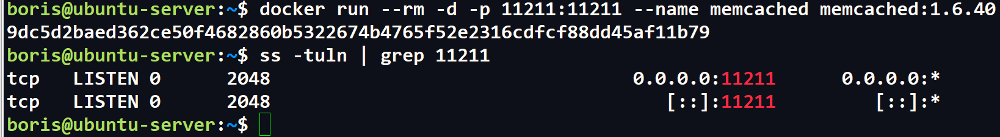
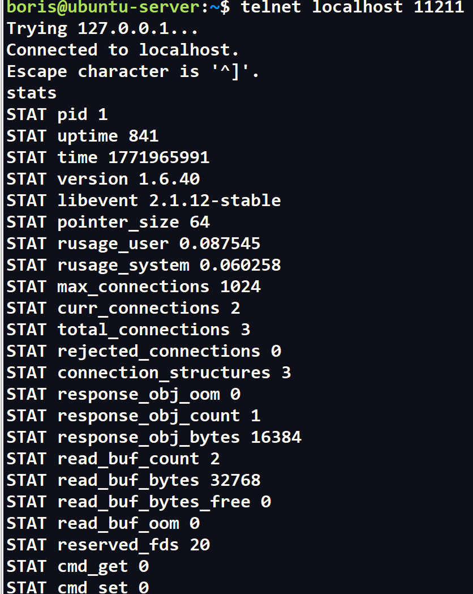
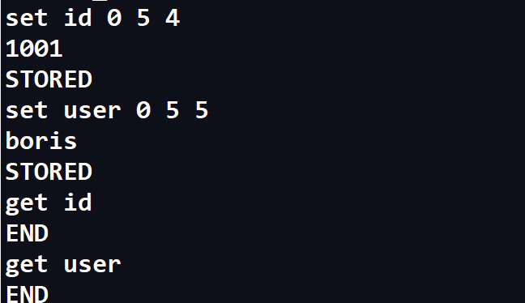
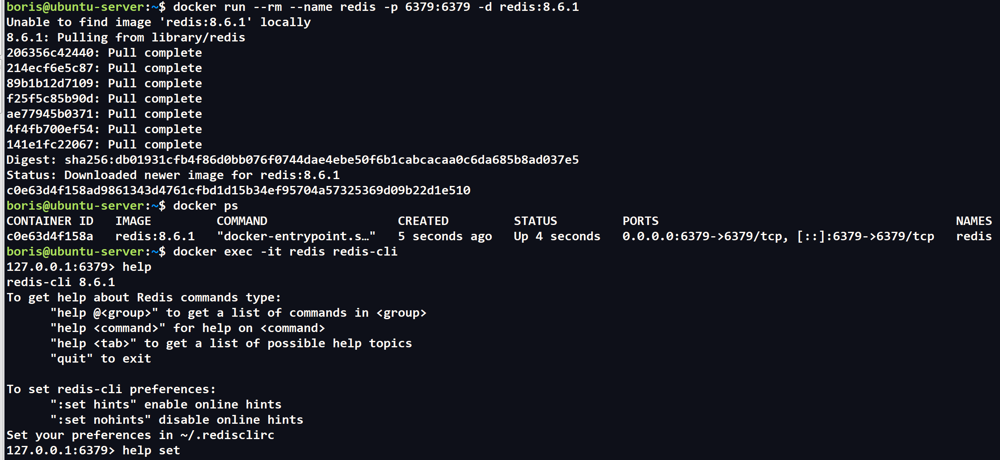
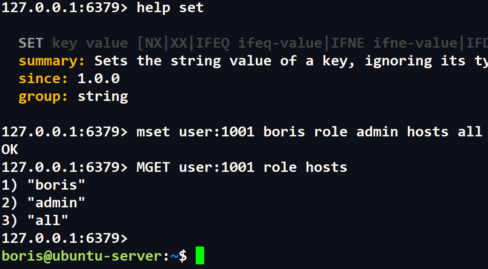
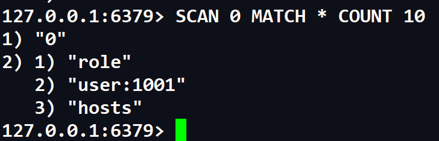

# Домашнее задание к занятию "`Кеширование Redis/memcached`" - `Сидоров Борис`

---
---

### Задание 1. Кеширование 

Приведите примеры проблем, которые может решить кеширование. 

*Приведите ответ в свободной форме.*

---

### Решение 1
Одна из самых очевидных проблем которую решает **`кэширование`** это производительность системы **`СУБД`**, в частности без **`кэширования`** **`SQL БД`** чувствовали бы себя очень плохо, ведь в **`SQL БД`** используется целый язык запросов **`sql`** и они могут быть очень тяжелыми и сложными для обработки системы. **`Кеширование`** как раз и решает проблему производительности, за счет того, что часто используемые данные к которым мы обращаемся помещаются в специальную область в **`оперативной памяти`**, что ускоряет процесс обработки запросов. В **`PostgreSQL`** уже из коробки предусмотрено несколько уровней системы **`кэширования`**, это говорит о том, что любая система зависима от эффективности работы **`кеширования`**.

В ряде случаев, для того чтобы система не захлебнулась от большого количества запросов в пик нагрузки, специально прогнозируют это самое время и подключают дополнительные ресурсы ведь в условиях высокой конкуренции на рынке порой недопустимы и секунды простоя сервиса. Подключение дополнительных ресурсов **`кэширования`** данных может спасти ситуацию от резких скачков нагрузки на систему.

**`Кэширование`** позволяет также экономить ресурсы системы, на примере тяжелых запросов которые потребляют большое количество вычислительных мощностей, эти запросы можно поместить в **`кэш`**, что существенно облегчит работу с данными.

В процессе разработки любого приложения уделяется большое внимание на то, насколько эффективно будет работать код с памятью и **`кешированием`**, так как самая быстрая память это **`кеш`** в **`процессоре`** (если рассматривать в разрезе аппаратной части) и её не так много и она очень дорогая. В **`инфраструктуре`** **`кешу`** уделяют не меньше внимания так как от этого зависит насколько стабильно будет работать продукт, который приносит прибыль компаниям.

Если брать сетевую часть, то **`кеширование`** ответов для внешних приложений так же важно. К примеру, есть какие-то данные которые пользователи часто запрашивают и если постоянно генерировать итоговый ответ для каждого **`сетевого соединения`**, то это может привести к задержкам. Тут система **`кеширования`** также будет выручать и разгружать уже сетевую часть **`инфраструктуры`**.

---
---

### Задание 2. Memcached

Установите и запустите memcached.

*Приведите скриншот systemctl status memcached, где будет видно, что memcached запущен.*

---

### Решение 2
Так как мы изучаем **`DevOps`** практики, то для выполнения данного задания я буду использовать **`Docker`**. Разверну контейнер с **`Memcached`** на хосте с пробросом портов и подключусь к целевому порту на котором работает **`БД 11211`**.

Запускаю контейнер и проверяю открыт ли порт **`11211`** на котором должен работать **`memcached`**.

Вспоминаю, что взаимодействие с **`memcached`** осуществляется через **`telnet`**, пробую подключиться к порту и ввести команду **`stats`** для того чтобы убедиться, что это действительно **`memcached`**, а не что-то другое.

Контейнер с **`memcached`** работает и я могу взаимодействовать с сервисом не засоряя окружения своего хоста устанавливая отдельный пакет с **`memcached`**. Так как при создании контейнера я использовал аргумент **`--rm`**, после остановки он удалится, так как задачи пока носят тестовый характер я посчитал это лучшим решением по его выполнению, да и **`докер`** вспомнить тоже нужно. Все последующие задания я так же буду выполнять используя **`докер`**.

---
---

### Задание 3. Удаление по TTL в Memcached

Запишите в memcached несколько ключей с любыми именами и значениями, для которых выставлен TTL 5. 

*Приведите скриншот, на котором видно, что спустя 5 секунд ключи удалились из базы.*

---

### Решение 3
Запишу в **`БД`** ключ **`user`** и **`id`**, в задании сказано выставить **`TTL 5`**. Для **`user`** значение будет **`boris`**, для **`id`** **`1001`**. Так как время жизни очень маленькое я вряд ли успею получить данные по ключам через **`get`**. Пробую.

Как и предполагал, после **`get`** в консоли не вижу никаких значений так как ключ уже не существует из-за низкого значения **`TTL`**. Выставляется значение **`TTL`** после указания наименования ключа и обязательного флага **`0`**, то есть вторая цифра после нуля:
**`set user 0 5 5`** (первая **`5`** - это и есть **`TTL`**, вторая - размер количества символов в значении к ключу).

---
---

### Задание 4. Запись данных в Redis

Запишите в Redis несколько ключей с любыми именами и значениями. 

*Через redis-cli достаньте все записанные ключи и значения из базы, приведите скриншот этой операции.*

---

### Решение 4
Так же как и в задании 3 я буду использовать **`docker`** для запуска сервиса **`Redis`** и подключусь к контейнеру интерактивно через аргумент **`-it`** и сразу передам команду для подключения к **`cli`** **`redis`** **`redis-cli`**. Порт **`6379`** проброшу на хост.

Создание контейнера с пробросом порта из **`image`** **`redis:8.6.1`** и подключение к нему в интерактивном режиме выполнено успешно. Можно приступить к работе в **`redis`**, создам сразу несколько ключей, а потом сразу запрошу их значения через команды **`MSET`**, **`MGET`**.

Получилось, ключи записались и были успешно считаны через **`get`**.

В случае если мне неизвестны какие ключи существуют в базе, можно получить их список через безопасную команду **`SCAN 0`** (число курсора) **`MATCH`** (по какому совпадению нужно искать) **`*`** (допустим все что есть) **`COUNT`** (количество строк для вывода) **`10`** (к примеру максимум 10 строк).

Таким образом я вижу какие ключи есть в базе и дальше можно запросить через **`get`** или сразу несколько через **`mget`**.