# Домашнее задание к занятию "`ELK`" - `Сидоров Борис`

### Задание 1. Elasticsearch 

Установите и запустите Elasticsearch, после чего поменяйте параметр cluster_name на случайный. 

*Приведите скриншот команды 'curl -X GET 'localhost:9200/_cluster/health?pretty', сделанной на сервере с установленным Elasticsearch. Где будет виден нестандартный cluster_name*.

---

### Решение 1
Для решения задачи по развертыванию сервиса **`Elasticsearch`** буду использовать **`docker`**, а именно буду поднимать контейнеры через **`docker compose`**. Первым делом создам файл **`compose.yml`** в котором опишу развертывание сервиса **`elasticsearch`**. Из важного 
- укажу проброс порта **`9200`**, 
- **`discovery.type=single-node`** переменные окружения для работы в режиме **`single-node`**, 
- **`xpack.security.enabled=false`** отключу функции аутентификации и авторизации, так как это тестовая среда.

Ключевой момент для решения задания подложу измененный конфиг в директиве **`volumes`** где будет использоваться нестандартное имя для поля **`cluster_name`**:  
**`./elasticsearch.yml:/usr/share/elasticsearch/config/elasticsearch.yml`**

Запускаю **`docker compose up -d`**.
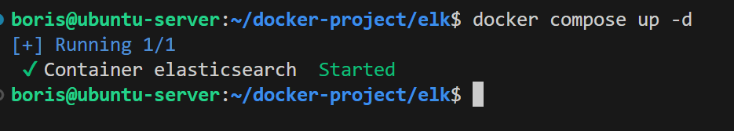

.png)

Ранее уже пробовал запускать контейнер поэтому процесс прошел быстро. Сразу проверю через **`curl`** состояние сервиса.
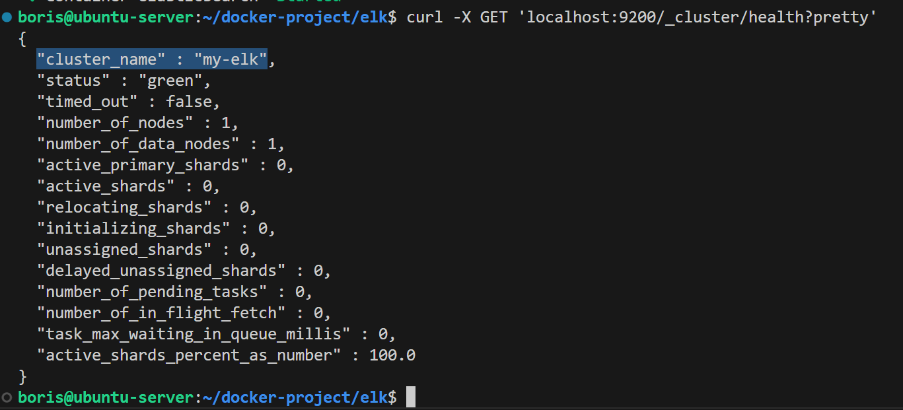

Вижу, что конфигурационный файл используется тот что указан в директиве **`volumes`** и **`cluster_name`** такой какой я указал, а не дефолтный **`docker-cluster`**.

**`docker compose file`** для первого задания тут:
[**`docker-compose-task1.yml`**](docker-compose/docker-compose-task1.yml)

конфигурационный файл для **`elasticsearch`** тут:
[**`elasticsearch.yml`**](configs/elasticsearch.yml)

---
---

### Задание 2. Kibana

Установите и запустите Kibana.

*Приведите скриншот интерфейса Kibana на странице http://<ip вашего сервера>:5601/app/dev_tools#/console, где будет выполнен запрос GET /_cluster/health?pretty*.

---

### Решение 2
Продолжаю работать в рамках проекта **`docker-compose.yml`**. Для запуска сервиса **`kibana`** мне потребуется дописать параметры требуемого мне сервиса а именно:

- **`image: kibana:8.14.3`** — образ из которого буду разворачивать контейнер
- **`ports: 5601:5601`** — проброс портов с хоста в контейнер для доступа к веб интерфейсу
- **`depends_on: elasticsearch`** — зависимость запуска от сервиса **`elasticsearch`**, так как без **`elasticsearch`** сервис **`kibana`** бессмысленно поднимать
- **`environment: ELASTICSEARCH_HOSTS=http://elasticsearch:9200`** — переменная окружения в котором передаем адрес до нашего хранилища логов, так как **`docker`** проект будет запускаться в рамках одной сети **`docker`**, можно использовать имя сервиса вместо поиска **`ip`** **`elasticsearch`**

Итоговый файл **`docker compose`**:
[**`docker-compose-task2.yml`**](docker-compose/docker-compose-task2.yml)

Запускаем проект и проверяем работу сервиса.
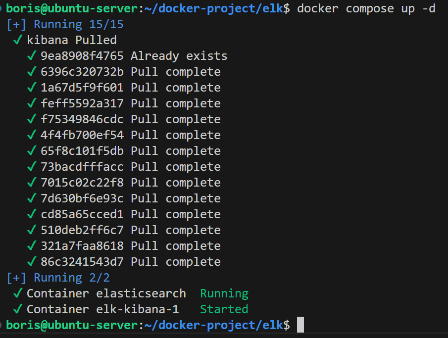

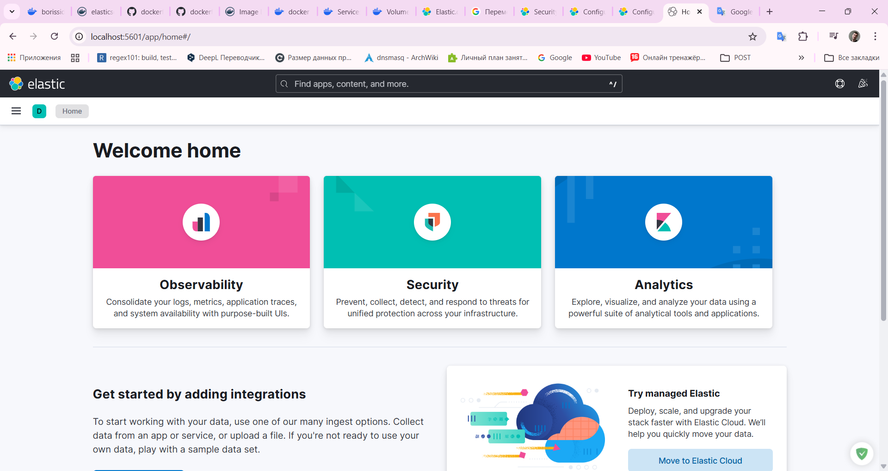

Сервис работает.
Теперь выполняем задачу по заданию. Выполняем запрос **`GET /_cluster/health?pretty`** прямо в консоли клиента **`dev tools`** в веб-интерфейсе **`kibana`**.
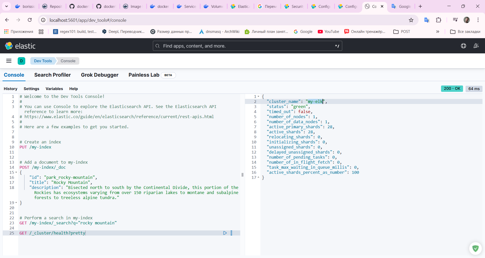

Видно, что обращение к **`Elasticsearch`** работает и в выводе получили ответ со статусом **`200`** и данными.

---
---

### Задание 3. Logstash

Установите и запустите Logstash и Nginx. С помощью Logstash отправьте access-лог Nginx в Elasticsearch. 

*Приведите скриншот интерфейса Kibana, на котором видны логи Nginx.*

---

### Решение 3
Продолжаю работать в проекте **`docker compose`**. В задании сказано запустить сервис **`Logstash`** и **`Nginx`**. В **`compose.yml`** я допишу конфигурацию развертывания сервиса **`Logstash`**, а **`Nginx`** у меня уже установлен с прошлых заданий и лог файл доступа уже имеется. В **`yml`** файле я дописал следующий блок по сервису **`Logstash`**:

- **`image: logstash:8.14.3`**
- **`container_name: logstash`**
- **`user: 1000:4`** — тут важная строка которая добавляет пользователю **`logstash`** с **`id 1000`** принадлежность к группе **`id 4`** (**`adm`**). Это решает проблему с доступом на чтение лог файла, ведь именно группе **`adm`** выставлен доступ на чтение в атрибутах на хосте.
- **`environment`**: добавлены две переменные.  
  **`PACK_MONITORING_ENABLED: "false"`** отключение **`XPACK мониторинга`**  
  **`ES_HOST: "elasticsearch:9200"`** адрес для **`elasticsearch`**
- **`ports: "5044:5044"`** пробрасываю порт
- **`volumes`**: тут я пробрасываю ряд томов в контейнер  
  - **`./configs/logstash/pipelines.yml:/usr/share/logstash/config/pipelines.yml`** — конфигурационный файл **`pipelines.yml`**  
  - **`./configs/logstash/pipelines:/usr/share/logstash/config/pipelines`** — целиком всю директорию **`pipelines`** в котором будут хранится все пайплайны для работы сервиса  
  - **`/var/log/nginx:/var/log/nginx/:ro`** — директория в которой хранится лог файл **`nginx`**, цель задания.
- **`depends_on: elasticsearch`** — зависимость от сервиса **`elasticsearch`**

Итоговый файл **`docker-compose .yml`** получился таким:  
[**`docker-compose-task3.yml`**](docker-compose/docker-compose-task3.yml)

В конфигурационном файле **`pipelines.yml`** из важного является строка с путем до директории с пайплайнами **`path.config: "/usr/share/logstash/config/pipelines/nginx.conf"`** и **`id`** пайплайна.  
[**`pipelines.yml`**](configs/logstash/pipelines.yml)

В самом **`pipeline`** для **`logstash`** на ввод описан плагин **`file`**:
```
input {
  file {
    path => "/var/log/nginx/example-http.com-acess.log"
    start_position => "beginning"
  }
}
```

В **`filter`** заранее проанализировав логи которые будут поступать, попросил нейронку сформировать регулярку для **`grok`**:
```
filter {
  grok {
    match => { "message" => "%{IPORHOST:client_ip} - - \[%{HTTPDATE:timestamp}\] \"%{WORD:method} %{URIPATHPARAM:request} HTTP/%{NUMBER:http_version}\" %{NUMBER:response_code:int} .* \"%{GREEDYDATA:user_agent}\"" }
  }
}
```

В вывод добавил стандартный вывод для быстрого просмотра и соответственно сам сервис **`elasticsearch`**, помимо хоста добавил и **`index`** с добавлением даты для удобства последующего анализа логов:
```
output {
  stdout {
  }
  elasticsearch {
      hosts => [ "${ES_HOST}" ]
      index => "logs_app_gen%-%{+YYYY.MM.dd}"
  } 
} 
```
[**`nginx.conf`**](configs/logstash/pipelines/nginx.conf)


**Демонстрация работы.**  
Запускаю проект.
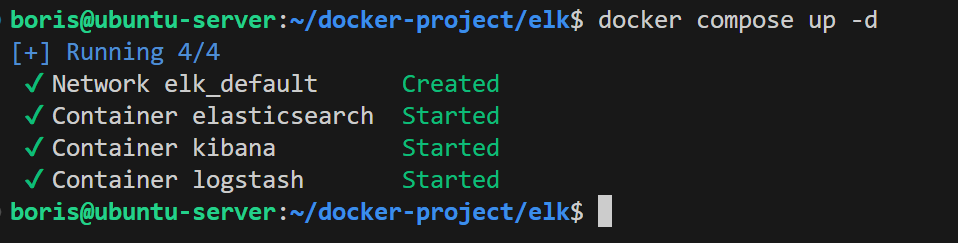

Смотрю логи контейнера **`logstash`**.
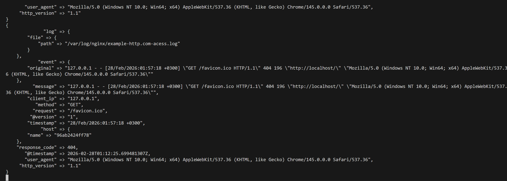

Вижу, что логи полетели.  
Открываю веб-интерфейс **`kibana`** и смотрю какие данные появились.
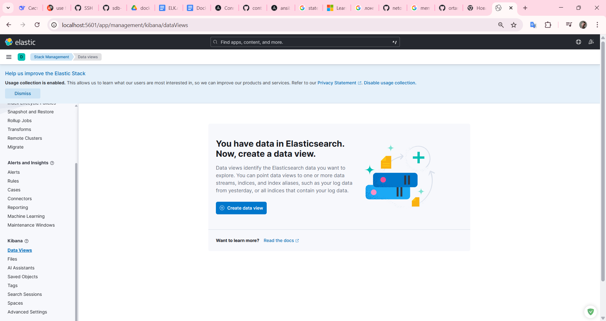

Вижу **`kibana`** сообщает, что уже есть данные для обработки. Создают **`data view`**.
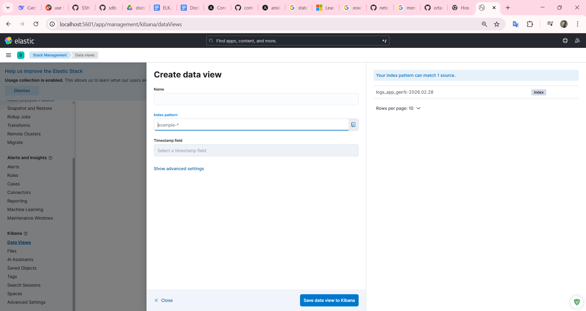

Вижу, что появился мой **`index`**, который описывал в **`pipeline`**:  
**`index => "logs_app_gen%-%{+YYYY.MM.dd}"`**  
Задаю имя представления данных и все совпадения по моему индексу через ***** и сохраняю.
.png)

Перехожу в **`discovery`** панель и смотрю какие данные там есть.
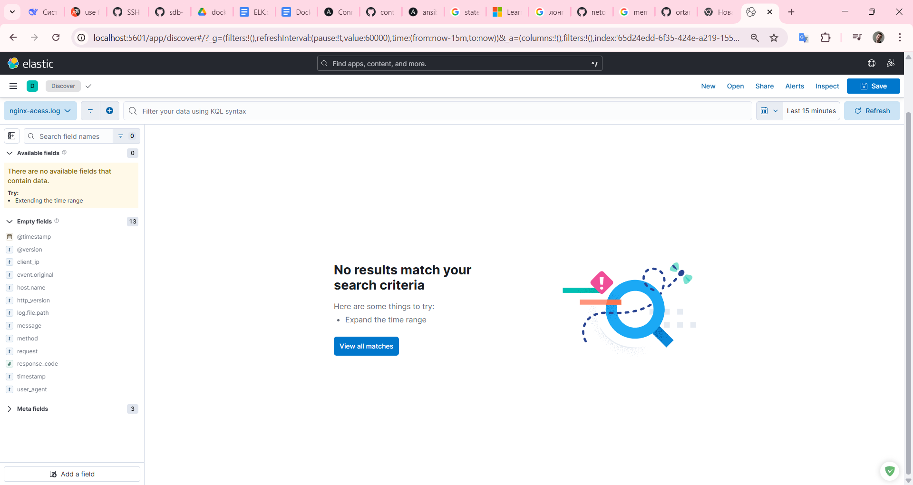

Вижу, что за последние **`15`** минут сообщений нет. Имитируя активность, перехожу на **`localhost:80`** который слушает **`nginx`**, после чего обновляю страничку в **`kibana`** и проверяю что появилось.
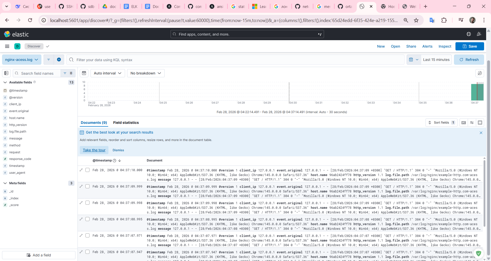

Вижу, что данные появились, а значит **`logstash`** успешно считывает лог файл **`nginx`** и передает в **`elasticsearch`**.

