# Домашнее задание к занятию "`ELK`" - `Сидоров Борис`

### Задание 1. Elasticsearch 

Установите и запустите Elasticsearch, после чего поменяйте параметр cluster_name на случайный. 

*Приведите скриншот команды 'curl -X GET 'localhost:9200/_cluster/health?pretty', сделанной на сервере с установленным Elasticsearch. Где будет виден нестандартный cluster_name*.

---

### Решение 1
Для решения задачи по развертыванию сервиса **`Elasticsearch`** буду использовать **`docker`**, а именно буду поднимать контейнеры через **`docker compose`**. Первым делом создам файл **`compose.yml`** в котором опишу развертывание сервиса **`elasticsearch`**. Из важного 
- укажу проброс порта **`9200`**, 
- **`discovery.type=single-node`** переменные окружения для работы в режиме **`single-node`**, 
- **`xpack.security.enabled=false`** отключу функции аутентификации и авторизации, так как это тестовая среда.

Ключевой момент для решения задания подложу измененный конфиг в директиве **`volumes`** где будет использоваться нестандартное имя для поля **`cluster_name`**:  
**`./elasticsearch.yml:/usr/share/elasticsearch/config/elasticsearch.yml`**

Запускаю **`docker compose up -d`**.
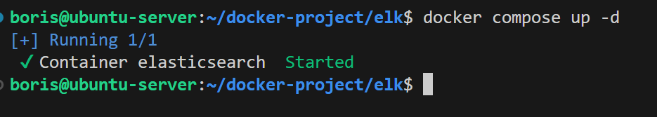

.png)

Ранее уже пробовал запускать контейнер поэтому процесс прошел быстро. Сразу проверю через **`curl`** состояние сервиса.
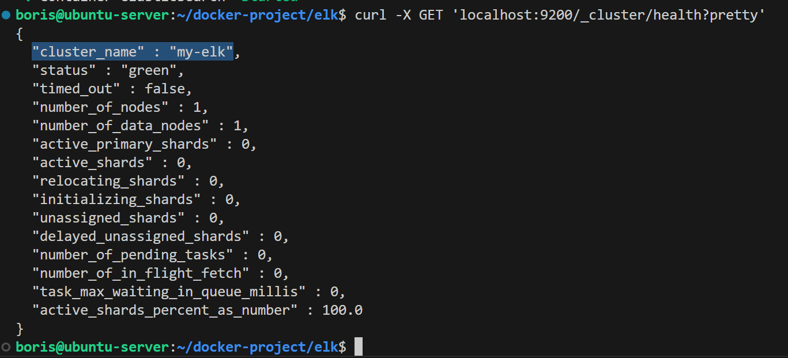

Вижу, что конфигурационный файл используется тот что указан в директиве **`volumes`** и **`cluster_name`** такой какой я указал, а не дефолтный **`docker-cluster`**.

**`docker compose file`** для первого задания тут:
[**`docker-compose-task1.yml`**](docker-compose/docker-compose-task1.yml)

конфигурационный файл для **`elasticsearch`** тут:
[**`elasticsearch.yml`**](configs/elasticsearch.yml)

---
---

### Задание 2. Kibana

Установите и запустите Kibana.

*Приведите скриншот интерфейса Kibana на странице http://<ip вашего сервера>:5601/app/dev_tools#/console, где будет выполнен запрос GET /_cluster/health?pretty*.

---

### Решение 2
Продолжаю работать в рамках проекта **`docker-compose.yml`**. Для запуска сервиса **`kibana`** мне потребуется дописать параметры требуемого мне сервиса а именно:

- **`image: kibana:8.14.3`** — образ из которого буду разворачивать контейнер
- **`ports: 5601:5601`** — проброс портов с хоста в контейнер для доступа к веб интерфейсу
- **`depends_on: elasticsearch`** — зависимость запуска от сервиса **`elasticsearch`**, так как без **`elasticsearch`** сервис **`kibana`** бессмысленно поднимать
- **`environment: ELASTICSEARCH_HOSTS=http://elasticsearch:9200`** — переменная окружения в котором передаем адрес до нашего хранилища логов, так как **`docker`** проект будет запускаться в рамках одной сети **`docker`**, можно использовать имя сервиса вместо поиска **`ip`** **`elasticsearch`**

Итоговый файл **`docker compose`**:
[**`docker-compose-task2.yml`**](docker-compose/docker-compose-task2.yml)

Запускаем проект и проверяем работу сервиса.
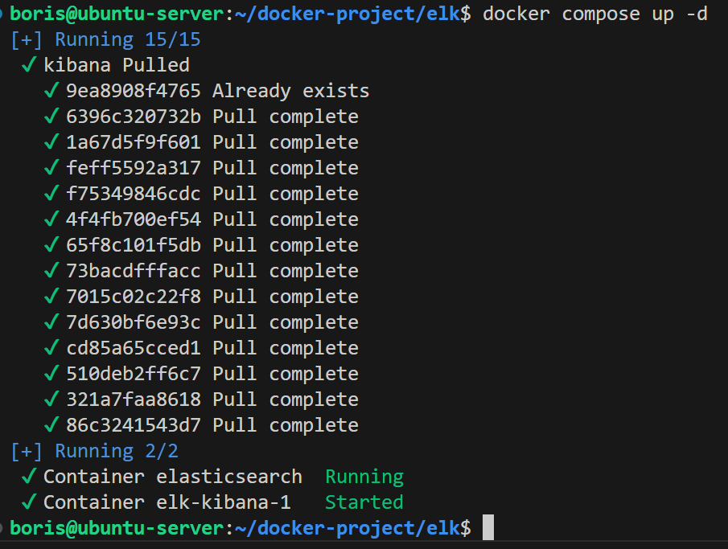

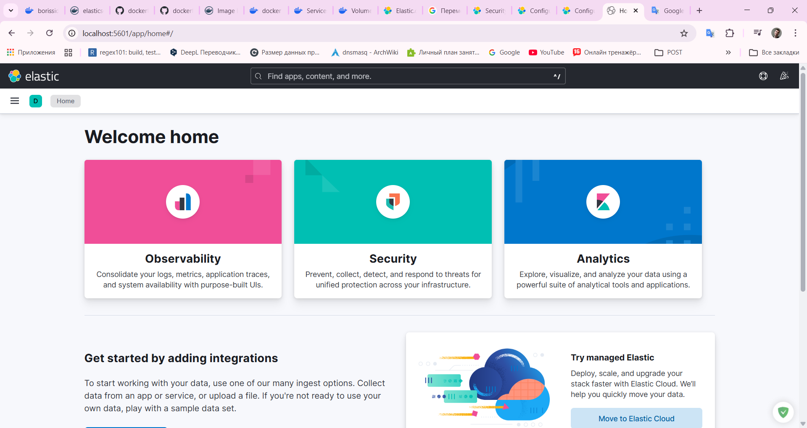

Сервис работает.
Теперь выполняем задачу по заданию. Выполняем запрос **`GET /_cluster/health?pretty`** прямо в консоли клиента **`dev tools`** в веб-интерфейсе **`kibana`**.
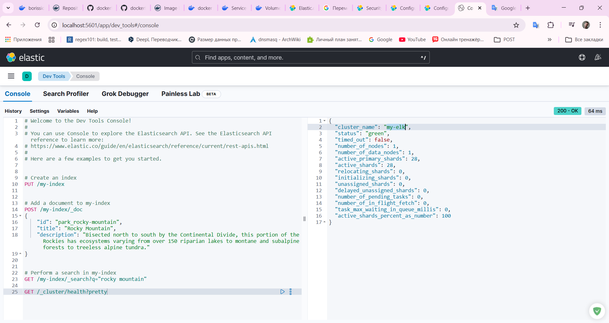

Видно, что обращение к **`Elasticsearch`** работает и в выводе получили ответ со статусом **`200`** и данными.

---
---

### Задание 3. Logstash

Установите и запустите Logstash и Nginx. С помощью Logstash отправьте access-лог Nginx в Elasticsearch. 

*Приведите скриншот интерфейса Kibana, на котором видны логи Nginx.*

---

### Решение 3
Продолжаю работать в проекте **`docker compose`**. В задании сказано запустить сервис **`Logstash`** и **`Nginx`**. В **`compose.yml`** я допишу конфигурацию развертывания сервиса **`Logstash`**, а **`Nginx`** у меня уже установлен с прошлых заданий и лог файл доступа уже имеется. В **`yml`** файле я дописал следующий блок по сервису **`Logstash`**:

- **`image: logstash:8.14.3`**
- **`container_name: logstash`**
- **`user: 1000:4`** — тут важная строка которая добавляет пользователю **`logstash`** с **`id 1000`** принадлежность к группе **`id 4`** (**`adm`**). Это решает проблему с доступом на чтение лог файла, ведь именно группе **`adm`** выставлен доступ на чтение в атрибутах на хосте.
- **`environment`**: добавлены две переменные.  
  **`PACK_MONITORING_ENABLED: "false"`** отключение **`XPACK мониторинга`**  
  **`ES_HOST: "elasticsearch:9200"`** адрес для **`elasticsearch`**
- **`ports: "5044:5044"`** пробрасываю порт
- **`volumes`**: тут я пробрасываю ряд томов в контейнер  
  - **`./configs/logstash/pipelines.yml:/usr/share/logstash/config/pipelines.yml`** — конфигурационный файл **`pipelines.yml`**  
  - **`./configs/logstash/pipelines:/usr/share/logstash/config/pipelines`** — целиком всю директорию **`pipelines`** в котором будут хранится все пайплайны для работы сервиса  
  - **`/var/log/nginx:/var/log/nginx/:ro`** — директория в которой хранится лог файл **`nginx`**, цель задания.
- **`depends_on: elasticsearch`** — зависимость от сервиса **`elasticsearch`**

Итоговый файл **`docker-compose .yml`** получился таким:  
[**`docker-compose-task3.yml`**](docker-compose/docker-compose-task3.yml)

В конфигурационном файле **`pipelines.yml`** из важного является строка с путем до директории с пайплайнами **`path.config: "/usr/share/logstash/config/pipelines/nginx.conf"`** и **`id`** пайплайна.  
[**`pipelines.yml`**](configs/logstash/pipelines.yml)

В самом **`pipeline`** для **`logstash`** на ввод описан плагин **`file`**:
```
input {
  file {
    path => "/var/log/nginx/example-http.com-acess.log"
    start_position => "beginning"
  }
}
```

В **`filter`** заранее проанализировав логи которые будут поступать, попросил нейронку сформировать регулярку для **`grok`**:
```
filter {
  grok {
    match => { "message" => "%{IPORHOST:client_ip} - - \[%{HTTPDATE:timestamp}\] \"%{WORD:method} %{URIPATHPARAM:request} HTTP/%{NUMBER:http_version}\" %{NUMBER:response_code:int} .* \"%{GREEDYDATA:user_agent}\"" }
  }
}
```

В вывод добавил стандартный вывод для быстрого просмотра и соответственно сам сервис **`elasticsearch`**, помимо хоста добавил и **`index`** с добавлением даты для удобства последующего анализа логов:
```
output {
  stdout {
  }
  elasticsearch {
      hosts => [ "${ES_HOST}" ]
      index => "logs_app_gen%-%{+YYYY.MM.dd}"
  } 
} 
```
[**`nginx.conf`**](configs/logstash/pipelines/nginx.conf)


**Демонстрация работы.**  
Запускаю проект.
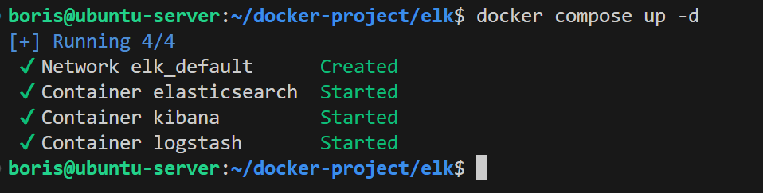

Смотрю логи контейнера **`logstash`**.
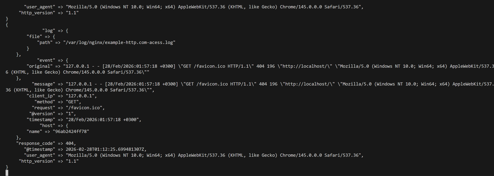

Вижу, что логи полетели.  
Открываю веб-интерфейс **`kibana`** и смотрю какие данные появились.
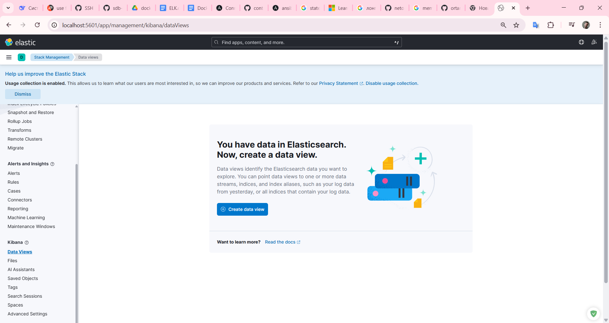

Вижу **`kibana`** сообщает, что уже есть данные для обработки. Создают **`data view`**.
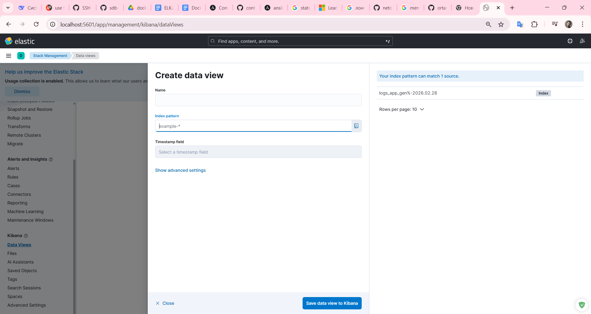

Вижу, что появился мой **`index`**, который описывал в **`pipeline`**:  
**`index => "logs_app_gen%-%{+YYYY.MM.dd}"`**  
Задаю имя представления данных и все совпадения по моему индексу через ***** и сохраняю.
.png)

Перехожу в **`discovery`** панель и смотрю какие данные там есть.
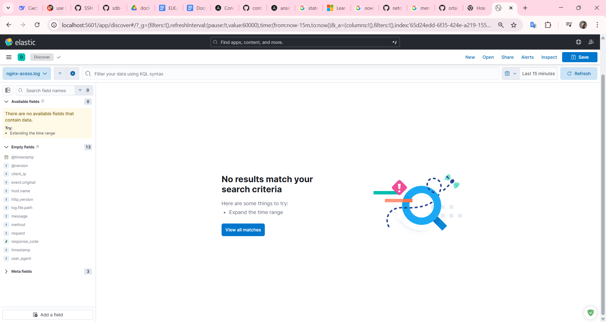

Вижу, что за последние **`15`** минут сообщений нет. Имитируя активность, перехожу на **`localhost:80`** который слушает **`nginx`**, после чего обновляю страничку в **`kibana`** и проверяю что появилось.
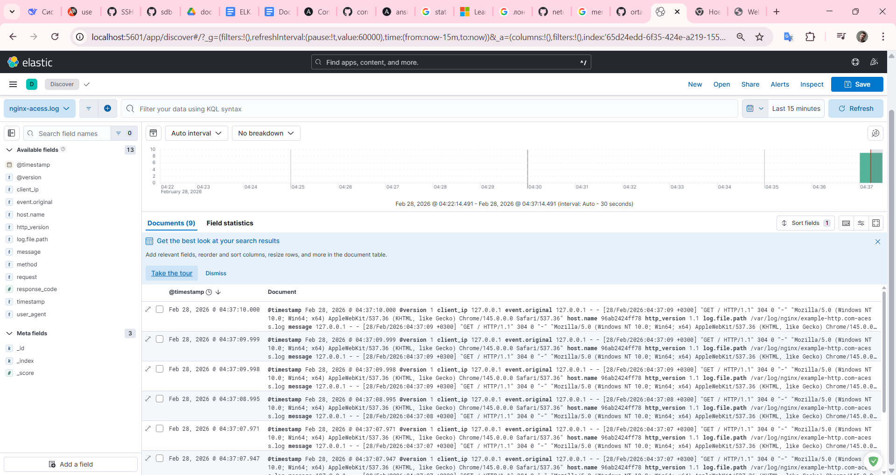

Вижу, что данные появились, а значит **`logstash`** успешно считывает лог файл **`nginx`** и передает в **`elasticsearch`**.

---
---

### Задание 4. Filebeat. 

Установите и запустите Filebeat. Переключите поставку логов Nginx с Logstash на Filebeat. 

*Приведите скриншот интерфейса Kibana, на котором видны логи Nginx, которые были отправлены через Filebeat.*

---

### Решение 4
В **`инфраструктуре`** лучшей практикой доставки логов в **`elasticsearch`** является **`logstash`**, но сам по себе этот сервис не рационально использовать в качестве агента на хосте, так как он много потребляет ресурсов хоста. Поэтому в качестве агента будет выступать сервис **`Filebeat`** который прекрасно работает с чтением файлов и передачи их содержимых уже либо напрямую в **`elasticsearch`** или передать эти данные для последующей обработки в **`logstash`**, чтобы в свою очередь был проведен парсинг полученных данных и потом уже готовые данные поступали в **`elasticsearch`** для удобного анализа через **`web`** сервис **`kibana`**. Эту модель я и буду реализовывать:  
**`filebeat > logstash > elasticsearch > kibana`**

Продолжаю работать с проектом **`docker compose`**. Добавляю сервис **`filebeat`**, важные директивы которые я описал:

- **`user: 1000:4`** — решает проблему со чтением логов **`nginx`**, где недостаточно прав на чтение лог файла **`nginx`** с хоста.
- **`volumes`**:  
  - **`./configs/filebeat/data/filebeat:/usr/share/filebeat/data`** — тут на самом деле выглядит как костыль, так как из-за директивы **`user`** в котором я изменил атрибуты возникает проблема с запуском контейнера, мета файлы не создаются из-за отсутсвия доступа. Я создал внутри проекта необходимые директории и выставил владельца **`sudo chown 1000:1000`** тем самым пользователю с **`id=1000`** проблем с доступом к директории не возникнет, а через **`volume`** просто пробросил эту директорию внутрь контейнера. Давать рута в контейнера не стал так как это не лучшая практика, также не стал создавать именованный том.  
  - **`./configs/filebeat/filebeat.yml:/usr/share/filebeat/filebeat.yml`** — пробрасываю конфигурационный файл в котором будет описан процесс чтения лог файла и передачи на сервис **`logstash`**  
  - **`/var/log/nginx:/var/log/nginx/`** — пробрасываю директорию с лог файлом **`nginx`**
- **`environment`**:  
  **`LOGSTASH_URL: "logstash:5044"`** — адрес до сервиса **`logstash`**

Также в проекте я закомментировал строку на проброс директории с логами в сервисе **`logstash`**, так как теперь сбором логов будет выступать **`filebeat`**.  
`# - /var/log/nginx:/var/log/nginx/`

Так как я буду создавать новый пайплайн для работы **`logstash`** я добавил новую переменную в которой отмечу название того конфигурационного файла который буду использовать в настройках **`pipelines.yml`**  
**`ACTIVE_PIPELINE: filebeat`**

Итоговый файл **`docker compose yml`** выглядит так:  
[**`docker-compose-task4.yml`**](docker-compose/docker-compose-task4.yml)

Видоизмененный файл **`pipelines.yml`** в котором проставляется переменная из **`docker yml`**  
[**`pipelines-task4.yml`**](configs/logstash/pipelines-task4.yml)

В конфигурационном файле для сервиса **`filebeat`** описал директиву **`type: log`** и путь до целевого логфайла данные которого необходимо будет передавать в сервис **`logstash`**. Так же добавил ещё одно поле **`acess.log: nginx`**. Которое появится в **`kibana`** для анализа. Файл получился таким:  
[**`filebeat.yml`**](configs/filebeat/filebeat.yml)

Создал новый **`pipeline`** для **`logstash`** в котором изменил блок **`input`**, указав плагин **`beats`** и порт **`5044`**. Этой конфигурацией говорю **`logstash`** принимать данные от агентов семейства **`Beats`**, куда соответственно сервис **`filebeat`** и входит. Все остальное не менял. Итоговый файл получился таким:  
[**`filebeat.conf`**](configs/logstash/pipelines/filebeat.conf)


**Демонстрация работы.**  
Запускаю доработанный проект.
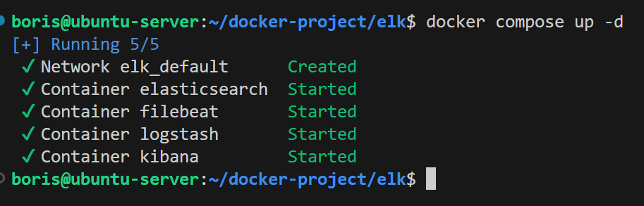

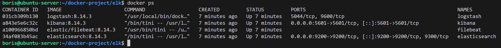

Все сервисы запустились. Проверяю в **`kibana`** появились ли данные.
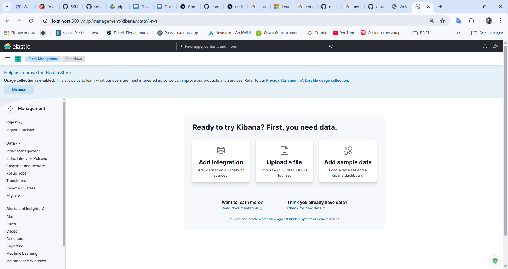

Данных пока нет. По логам **`filebeat`** вижу, что сервис работает и ошибок нет.  
Пробую сделать несколько запросов к **`nginx`**, а затем ещё раз проверю логи сервиса **`filebeat`**.
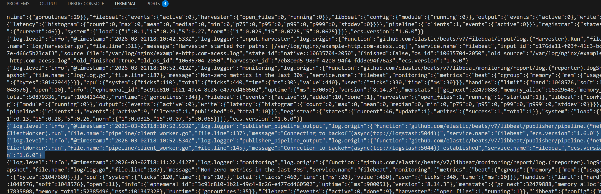

Вижу, что сервис осуществил **`tcp`** соединение с сервисом **`logstash`** по порту **`5044`**.  
Проверяю ещё раз **`kibana`**.
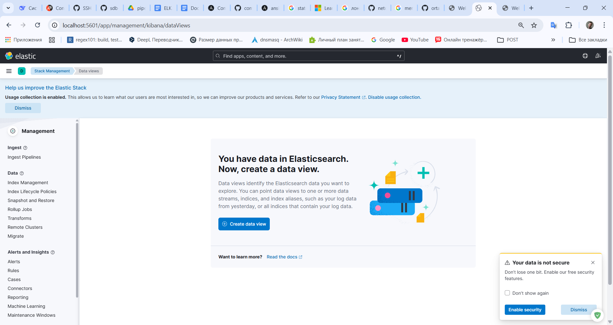

Вижу, что данные появились. Произвожу настройку **`Create data view`** как в предыдущей задаче и смотрю какие данные поступили.
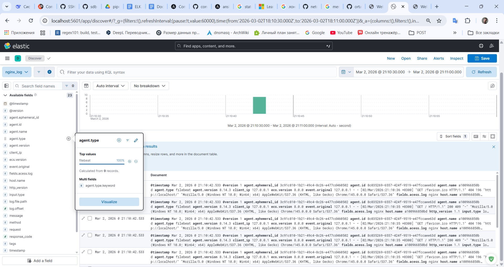

Вижу, что поступило **`9`** записей и тип агента в поле **`agent.type`** выступает **`filebeat`**.

---
---

### Задание 5*. Доставка данных 

Настройте поставку лога в Elasticsearch через Logstash и Filebeat любого другого сервиса , но не Nginx. 
Для этого лог должен писаться на файловую систему, Logstash должен корректно его распарсить и разложить на поля. 

*Приведите скриншот интерфейса Kibana, на котором будет виден этот лог и напишите лог какого приложения отправляется.*

---

### Решение 5
В качестве приложения которое будет поставлять логи я выбрал изученный ранее сервис **`Redis`**, как посоветовал лектор. Основная проблема заключается в том, что я буду запускать сервис в **`docker`** использовав образ **`redis:8.6.1`**, в этом образе используется **`open-source`** версия и логи будут писаться не в файл, а в стандартный поток вывода и ошибок контейнера, учитывая настройку драйвера логов, как я понял это стандартная практика. В задаче сказано собирать логи которые пишутся на файловую систему, а значит нужно видоизменить конфигурацию работу сервиса, для того чтобы логи писались в файл. С этим мне помогла нейронка посоветовав запустить контейнер **`redis`** с дополнительными аргументами, где будет сказано сервису запускаться используя мой кастомный конфиг, в свою очередь в котором я пропишу настройки для выгрузки лога в файл. Соответственно для всего этого мне понадобиться пробросить **`volumes`** с конфигурационным файлом и пути для хранения лога.

Углубляться в настройку конфигурационного файла для **`redis`** я не стал, из основного понял, что благодаря этому файлу мы говорим сервису **`redis`** сохранять все системные логи в файл по пути который мы пропишем, так же выставляем настройки персистентности, это уже за рамками данного задания, но понимаю, что благодаря им данные в **`redis`** будут сохранены в случае перезапуска контейнера.

И так у меня есть в наличии конфигурационный файл для **`redis`**:  
[**`redis.conf`**](configs/redis/conf/redis.conf)

Продолжаю развивать проект в **`docker compose`** и дописываю новый блок по развертыванию сервиса **`redis`**. Указываю все стандартные директивы как **`image`**, **`container_name`**, **`ports`**. Подробнее разберу следующие директивы:  
**`user: 1000:4`** — переопределяют **`id`** пользователя **`redis`** с **`999`** по умолчанию на **`1000`** и группу **`4`** (**`adm`**), так как я буду собирать логи не только с **`redis`**, но и **`nginx`**, поэтому решил привести все **`id`** в единообразный вид для избежания проблем с доступом для чтения файлов.

- **`command`**: в этой директиве как раз говорю **`docker`** разворачивать сервис используя мой кастомный конфигурационный файл который проброшу в директиве **`volumes`**  
  - **`"redis-server"`**  
  - **`"/usr/local/etc/redis/redis.conf"`**

- **`volumes`**: пробрасываю конфигурационный файл, путь для хранения логов и данных **`redis`**, для корректной работы  
  - **`./configs/redis/conf/redis.conf:/usr/local/etc/redis/redis.conf`**  
  - **`./configs/redis/logs/:/var/log/redis`**  
  - **`./configs/redis/data/:/data`**

Итоговый проект **`docker compose`** получился таким:  
[**`docker-compose-task5.yml`**](docker-compose/docker-compose-task5.yml)

Что касается настроек **`filebeat`** для сбора данных с лог файлов, в нем я дописал ещё один блок с типом **`log`**, путь где будут храниться эти файлы, а также добавить дополнительное поле **`log_type`** по которому можно будет определить в дальнейшем от какого сервиса эти логи. Я так же отредактировал директиву **`fields`** и для **`nginx`** из предыдущего задания, эти поля также пригодятся для сервиса **`logstash`**. Применяя условие **`if else`** **`pipeline`** для **`logstash`**, получится прописать отдельно для каждого сервиса свой фильтр для парсинга через **`grok`**.  
Итоговый конфигурационный файл для **`filebeat`** получился таким:  
[**`filebeat-task5.yml`**](configs/filebeat/filebeat-task5.yml)

Теперь касательно конфигурационного файла **`pipeline`** для сервиса **`logstash`**, как ранее упоминал, я использовал условие **`if else`** опираясь на поле **`log_type`**. Остальное не менял. Итоговый файл вышел таким:  
[**`filebeat-task5.conf`**](configs/logstash/pipelines/filebeat-task5.conf)


**Демонстрация работы.**  
Запускаю проект **`docker compose`** предварительно создав все необходимые директории внутри проекта которые будут прокинуты внутрь контейнера, а также выставив необходимого владельца и группы для решения проблем с правами доступа.
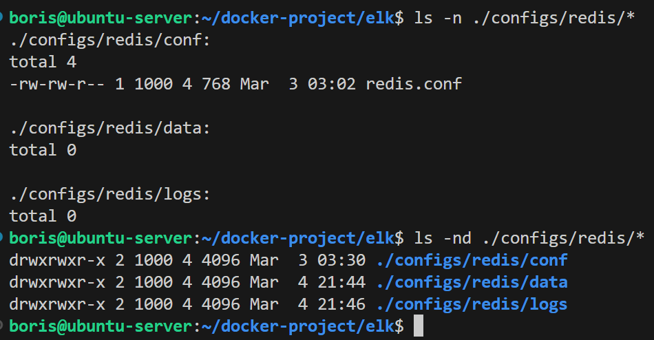

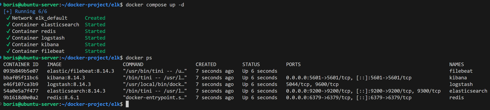

Проверю, что сервис **`logstash`** отправляет в **`stdout`**. Вижу логи **`nginx`**.
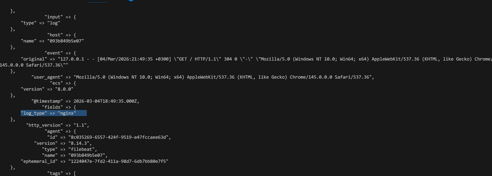

Вот и логи **`redis`**.
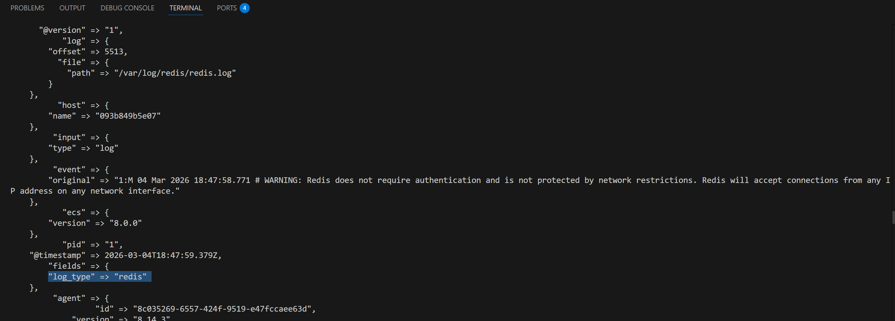

Теперь настрою **`kibana`** и визуализирую данные в **`discovery`**. Выставлю диапазон на **`15`** минут и посмотрю какие данные есть в указанный мной полях **[fields][log_type]**.
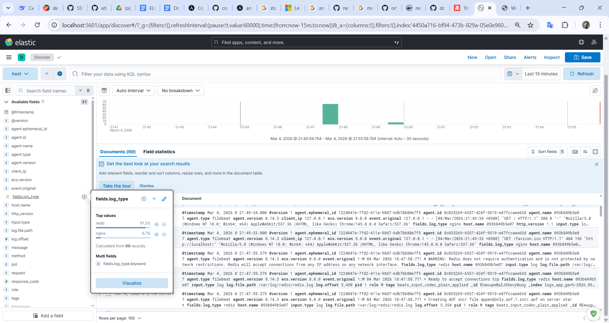

Данные есть по логам **`nginx`** так и **`redis`**. Остановлю работу контейнера **`redis`**, проверю поступят ли логи сигнализирующие об остановке сервиса.
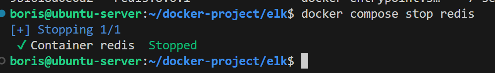

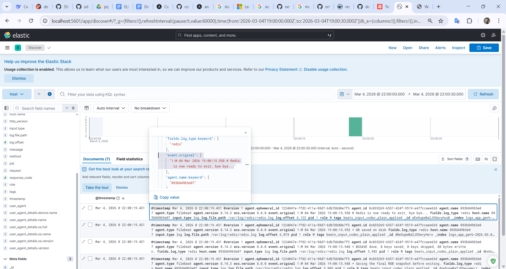

Да, логи от **`redis`** с сообщением что сервис был выключен поступили. Далее уже можно корректировать работу **`grok`** для лучшего парсинга логов, но это за рамками текущего задания.