# Домашнее задание к занятию "`Очереди RabbitMQ`" - `Сидоров Борис`

---
---

### Задание 1. Установка RabbitMQ

Используя Vagrant или VirtualBox, создайте виртуальную машину и установите RabbitMQ.
Добавьте management plug-in и зайдите в веб-интерфейс.

*Итогом выполнения домашнего задания будет приложенный скриншот веб-интерфейса RabbitMQ.*

--- 

### Решение 1
Решать задание буду используя **`docker compose`** следуя принципам **`DevOps`** инженера.
Разворачивать контейнер буду используя совсем простой **`docker compose yml`** файл, в котором опишу один сервис **`RabbitMQ`**, проброшу порты для работы **`AMQP`** и веб-интерфейса, а также допишу переменные окружения чтобы переопределить пользователя и пароль.

- **`image: rabbitmq:4.2.4-management`** — суффикс **`management`** говорит о том, что используется образ с включенным плагином управления **`Management Plugin`**
- **`environment`** — значения для переменных будут браться из **`.env`** файла, который находится в корне проекта **`docker`**
  - **`RABBITMQ_DEFAULT_USER=${RABBITMQ_DEFAULT_USER}`**
  - **`RABBITMQ_DEFAULT_PASS=${RABBITMQ_DEFAULT_PASS}`**
- **`ports`**
  - **`15672:15672`**
  - **`5672:5672`**

Итоговый **`docker compose`** файл получился таким:
[**`docker-compose-task1.yml`**](docker-compose/hw-04/docker-compose-task1.yml)


**Демонстрация работы.**  
Запускаю проект.


Для доступа к веб-интерфейсу необходимо использовать порт **`15672`**. Пароль и логин тот, что переопределён переменными окружения.


Готово, я в веб-интерфейсе сервиса **`RabbitMQ`**.

---
---

### Задание 2. Отправка и получение сообщений

Используя приложенные скрипты, проведите тестовую отправку и получение сообщения.
Для отправки сообщений необходимо запустить скрипт producer.py.

Для работы скриптов вам необходимо установить Python версии 3 и библиотеку Pika.
Также в скриптах нужно указать IP-адрес машины, на которой запущен RabbitMQ, заменив localhost на нужный IP.

```shell script
$ pip install pika
```

Зайдите в веб-интерфейс, найдите очередь под названием hello и сделайте скриншот.
После чего запустите второй скрипт consumer.py и сделайте скриншот результата выполнения скрипта

*В качестве решения домашнего задания приложите оба скриншота, сделанных на этапе выполнения.*

Для закрепления материала можете попробовать модифицировать скрипты, чтобы поменять название очереди и отправляемое сообщение.

---

### Решение 2
Для демонстрации работы развернутого в контейнере сервиса **`RabbitMQ`** на хосте мне потребуется первым делом установить необходимые сервисы по работе с языком **`python`**. Следуя лучшим практикам **`DevOps`** я установлю в директории проекта виртуальное окружение **`Python`** в корне проекта. Пакет **`python3`** у меня уже был установлен, теперь установлю в корне проекта **`виртуальное окружение`** командой:

**`python3.12 -m venv venv`**


Запущу виртуальное окружение командой:
**`source venv/bin/activate`**


Теперь, находясь в виртуальном окружении, установлю требуемую библиотеку **`pika`** для работы с очередями в **`RabbitMQ`**, выполню команду:
**`pip3.12 install pika`**


С этого момента могу приступать к работе со скриптами **`python`**.

В качестве продюсера был предложен скрипт, в котором осуществлялось подключение к серверу **`Rabbit`** без использования логина и пароля. Так как в первом задании эти параметры были переопределены через переменные окружения, скрипт нужно было доработать, добавив необходимые креды. Для избежания хардкода и указания чувствительных данных в явном виде я установлю ещё одну библиотеку **`python-dotenv`**, благодаря которой смогу в переменные прописать значения из файла **`.env`** по аналогии с **`docker compose yml`**, где прописывал значения в переменные окружения:
**`pip3.12 install python-dotenv`**


Ранее я уже устанавливал эту библиотеку. Теперь, доработав код, я смогу подключиться к серверу **`rabbit`**, используя логин и пароль. Вот кусок кода, в который я внёс изменения:

```python
    #!/usr/bin/env python
    # coding=utf-8
    import pika
    import os
    from dotenv import load_dotenv

    # Загружаем переменные из .env в окружение
    load_dotenv()

    RABBIT_HOST = os.getenv('RABBITMQ_HOST')
    RABBIT_USER = os.getenv('RABBITMQ_DEFAULT_USER')
    RABBIT_PASS = os.getenv('RABBITMQ_DEFAULT_PASS')

    # Проверяем, что все переменные загружены
    if not all([RABBIT_USER, RABBIT_PASS]):
        raise ValueError("Не удалось загрузить учётные данные из .env")

    credentials = pika.PlainCredentials(RABBIT_USER, RABBIT_PASS)
    parameters = pika.ConnectionParameters(
        host=RABBIT_HOST,
        credentials=credentials
    )

    connection = pika.BlockingConnection(parameters)
```

Итоговые скрипты **`producer`** и **`consumer`** получились такими:  
[**`producer.py`**](files/hw-04/producer.py)
[**`consumer.py`**](files/hw-04/consumer.py)

В скрипте **`consumer`** я тоже изменил часть кода, связанную со строкой **`channel.basic_consume`**, где указал очередь первым аргументом и видоизменил аргумент **`no_ack`** на **`auto_ack`**.


**Демонстрация работы.**  
Запускаю проект **`docker`**: в **`yml`** я ничего не менял с предыдущего задания, файл остался таким же. Далее запускаю скрипт **`producer`**.


Скрипт отработал без ошибок. Проверяю в веб-интерфейсе, появилась ли очередь **`hello`** и сообщение в ней.
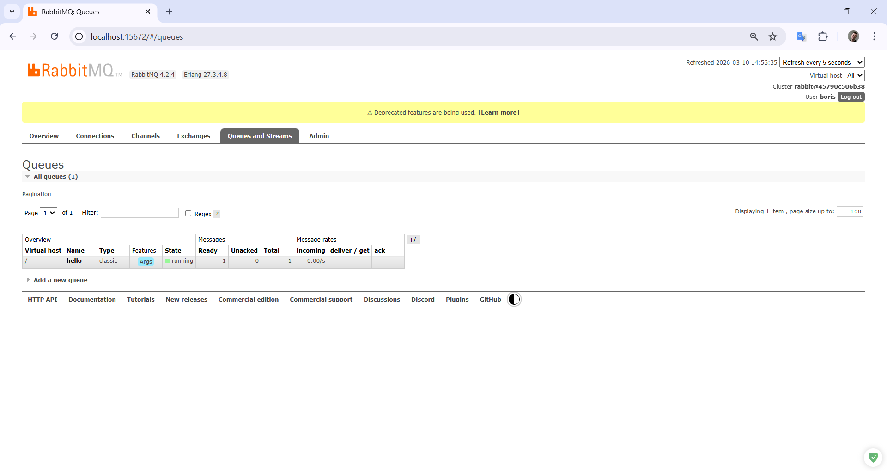

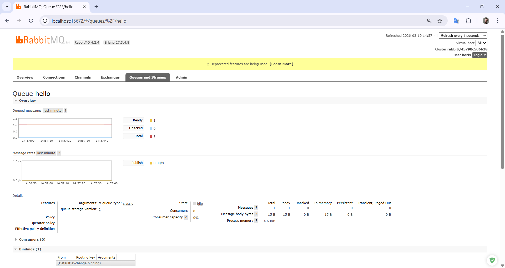

Вижу, что очередь **`hello`** появилась и в ней находится в памяти одно сообщение.  
Запускаю скрипт **`consumer`** во втором терминале.


Вижу сразу, что сообщение было прочитано и в **`body`** содержалось сообщение **`Hello Netology`**. Смотрю, что произошло в веб-интерфейсе **`rabbit`**.
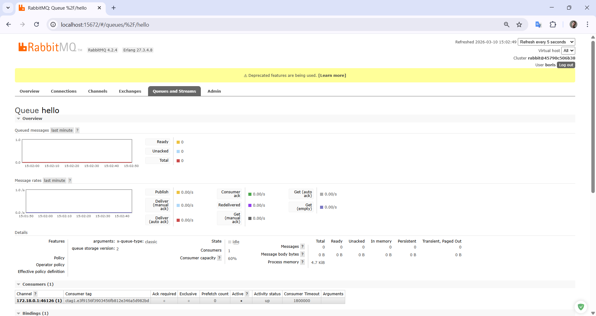

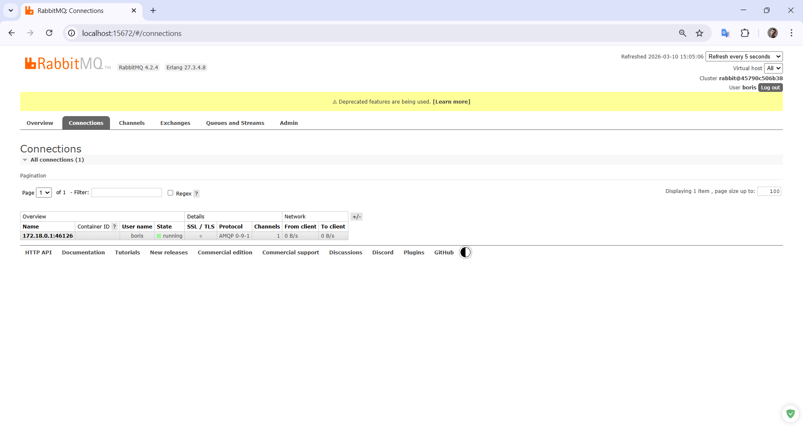

Сообщение было прочитано и удалено из очереди, а также есть активный подписчик, так как в скрипте **`consumer`** в последней строке скрипта, запускается consumer и происходит подписка к очереди.

Для наглядности я изменю тело сообщения в скрипте **`producer`** и запущу несколько раз изменённый скрипт в другом терминале.
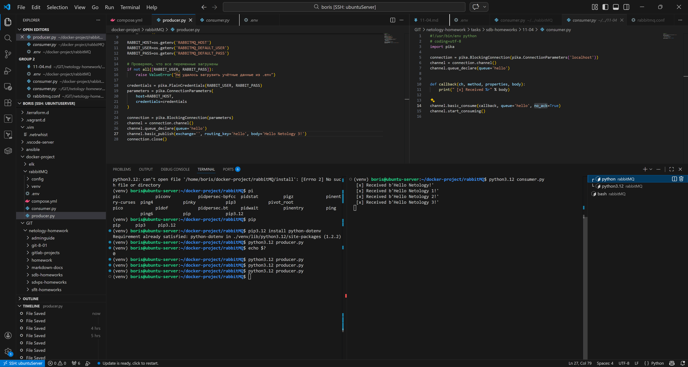

Вижу, что всё работает, и **`consumer`** успешно получает сообщения с любым телом в очереди **`hello`**.  
Попробую создать новую очередь **`like`** и направить туда новое сообщение; **`consumer`** не должен его получить, так как он подписан на очередь **`hello`**.
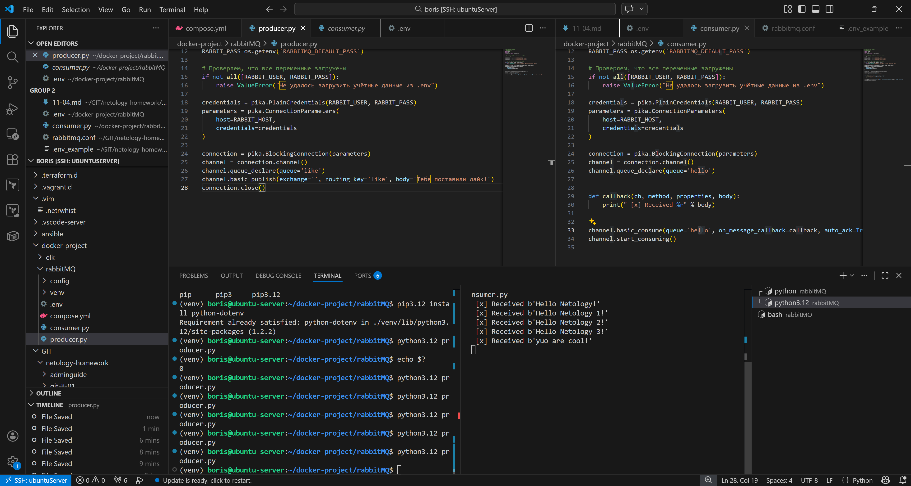


Видно, что **`consumer`**, подписанный на очередь **`hello`**, не получил сообщение, но в веб-интерфейсе видно, что появилась новая очередь **`like`** и в ней как раз находится новое сообщение.

---
---

### Задание 3. Подготовка HA кластера

Используя Vagrant или VirtualBox, создайте вторую виртуальную машину и установите RabbitMQ.
Добавьте в файл hosts название и IP-адрес каждой машины, чтобы машины могли видеть друг друга по имени.

Пример содержимого hosts файла:
```shell script
$ cat /etc/hosts
192.168.0.10 rmq01
192.168.0.11 rmq02
```
После этого ваши машины могут пинговаться по имени.

Затем объедините две машины в кластер и создайте политику ha-all на все очереди.

*В качестве решения домашнего задания приложите скриншоты из веб-интерфейса с информацией о доступных нодах в кластере и включённой политикой.*

Также приложите вывод команды с двух нод:

```shell script
$ rabbitmqctl cluster_status
```

Для закрепления материала снова запустите скрипт producer.py и приложите скриншот выполнения команды на каждой из нод:

```shell script
$ rabbitmqadmin get queue='hello'
```

После чего попробуйте отключить одну из нод, желательно ту, к которой подключались из скрипта, затем поправьте параметры подключения в скрипте consumer.py на вторую ноду и запустите его.

*Приложите скриншот результата работы второго скрипта.*

---

### Решение 3
Так как я начал практическое изучение **`RabbitMQ`** на новой версии, начиная с **`4.x`**, я столкнулся с проблемой при решении задачи, связанной с применением политики **`ha-all`**. В новых версиях **`RabbitMQ`** политика **`ha-all`** была полностью удалена из кода. Теперь отказоустойчивость достигается путем создания типа очереди как **`quorum`** + политика, в которой мы можем настроить балансировку лидеров очереди, если таких будет более **`1000`**. Создание очереди с типом **`quorum`** возлагается на **`backend`** приложения, т.е. сами приложения должны создавать очередь с типом **`quorum`**, а написанная политика будет уже применяться к этой очереди и расширять её возможности.

Если в новую версию **`Rabbit`** создать классическую очередь, то отказоустойчивость уже не будет обеспечена, так как репликация не будет работать, а политики **`ha-all`** уже не существует.

В связи с этим я отредактировал скрипт для создания очереди и публикации сообщения, добавив аргументы с типом очереди **`'x-queue-type': 'quorum'`** и аргумент, которым мы назначаем количество участников репликации в этой очереди **`'x-quorum-initial-group-size'`**.

Итоговый скрипт **`Python`**, который имитирует работу приложения, получился таким:
[**`producer.py`**](files/hw-04/code/producer.py)

**`consumer.py`** я тоже доработал, добавив порты в параметры для возможности подключаться к различным нодам в кластере для демонстрации работы. Скрипт получился таким:
[**`consumer.py`**](files/hw-04/consumer.py)

Далее я написал конфигурационный файл, в котором указал, как будет собираться кластер, а точнее, какой метод будет использоваться — это директива **`cluster_formation.peer_discovery_backend`**. Значение выбрал классическое **`rabbit_peer_discovery_classic_config`**, в котором есть четкий список доменных имен в формате **`rabbit@dns`**. Соответственно построчно указал все ноды, которые будут формировать кластер. Из важного указал путь, где будет храниться файл **`json`** с политиками, строка **`definitions.local.path = /etc/rabbitmq/definitions.d/`**.
Итоговый конфигурационный файл получился таким:
[**`20-defaults.conf`**](configs/hw-04/20-defaults.conf)

Что касается политик, я разделил их на **`2`** файла. В первом файле описал политику, которая будет применяться к очередям по паттерну **`".*"`**, т.е. к любой очереди вообще. А вот **`definition`** уже направлены на отказоустойчивость кластера:
- **`"overflow": "reject-publish"`** — для запрета на публикацию в случае перегрузки в очереди;
- **`"dead-letter-strategy": "at-least-once"`** — стратегия, при которой мёртвые письма не будут удалены из очереди, а хотя бы один раз будут доставлены в специальный обменник (правда, у меня такого нет, но буду следовать лучшим практикам и добавлю эту опцию, к тому же эта опция как раз работает только с типом очереди **`quorum`**);
- **`"queue-leader-locator": "balanced"`** — распределение лидеров очереди (это уже про балансировку между нодами и распределение нагрузки, правда, это работает только если очередей более **`1.000`**).

Первый **`json`**, связанный с политикой очередей, получился таким:
[**`10-defs-vhost.json`**](files/hw-04/policies/10-defs-vhost.json)

Второй **`json`** уже связан с пользователем и выдачей прав. Так как напрямую в **`json`** файле использовать переменные окружения, указанные в **`docker yml`**, не получится, я создал обычный **`bash`** скрипт, который возьмёт из переменных данные и напрямую сформирует **`json`** файл, используя **`Heredoc`**. Сложность в том, что пароль нельзя в сыром виде записать в **`json`**, поэтому в скрипте предварительно я сгенерирую хеш и уже в таком виде буду записывать в **`json`**, а в **`docker`** файле сделаю точкой входа этот скрипт. Скрипт получился таким:
[**`pass_hash.sh`**](files/hw-04/code/pass_hash.sh)

Вид второго **`json`** будет таким:
[**`20-defs-users.json`**](files/hw-04/policies/20-defs-users.json)

Теперь, что касается **`yml docker`**. Я буду создавать **`3`** сервиса, имитируя **`3`** **`ВМ`** с **`Rabbit`**. Решать проблему доменных имён буду через директиву **`hostname`**, а подключение к разным нодам через скрипт **`Python`** путём проброса разных портов с хоста к порту **`5672`** в контейнере. Также проброшу **`volumes`** со всеми необходимыми **`json`** и **`conf`** файлами, а директивой **`entrypoint`** обозначу запуск скрипта при старте. Также для сервисов с номерами, отличными от первого, поставлю зависимость от него, для того чтобы кластер смог сформироваться. Итоговый **`docker compose yml`** получился таким:
[**`docker-compose-task3.yml`**](docker-compose/hw-04/docker-compose-task3.yml)

**Демонстрация работы.**

Запускаю проект и проверяю, собрался ли кластер.
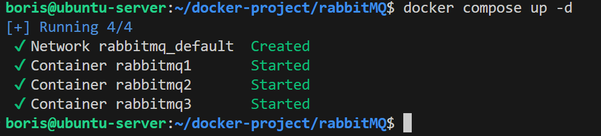

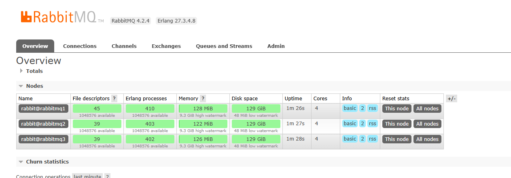

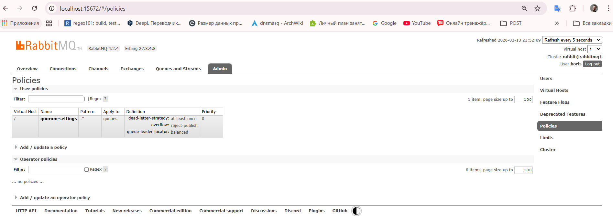

Да, кластер собран и политика тоже создалась.
Захожу в контейнеры и выполняю команду из задания.
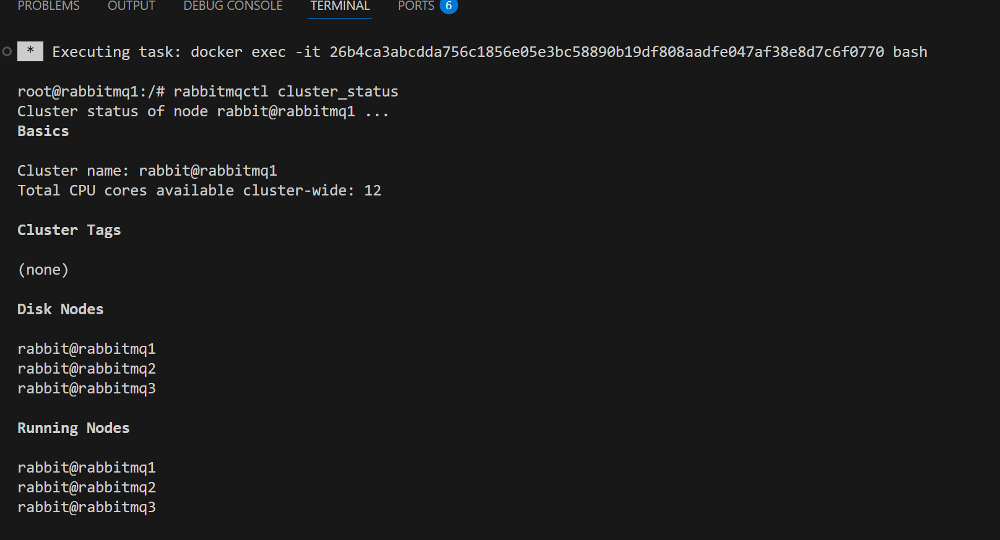

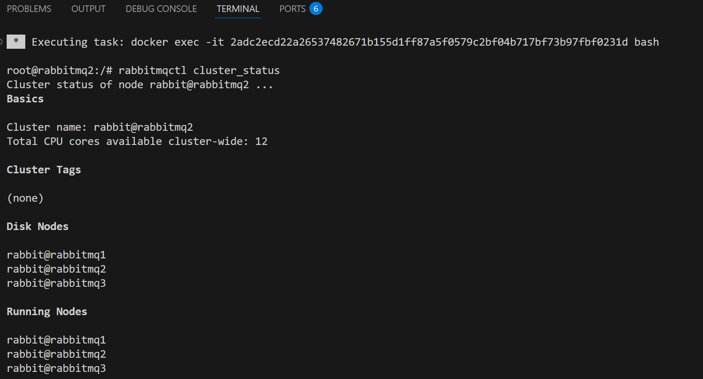

.png)

Теперь запускаю скрипт **`producer.py`**, создаю очередь и публикую сообщение.
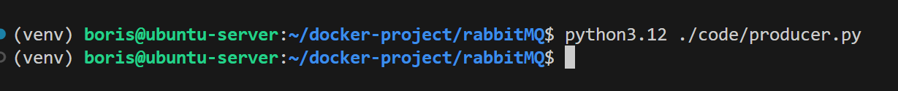

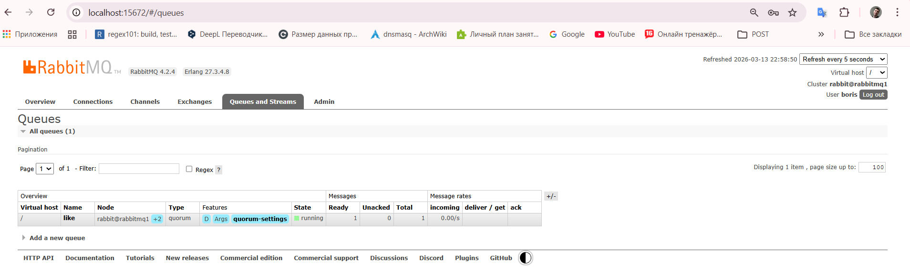

Очередь создалась и в ней есть одно сообщение.
Теперь по заданию захожу на ноды и пытаюсь считать это сообщение из очереди, используя **`cli`** инструмент.
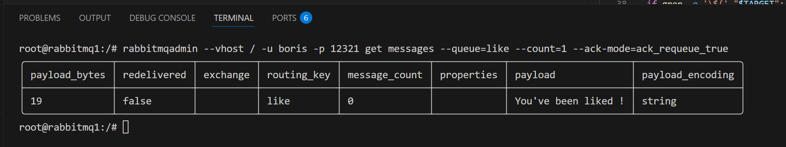


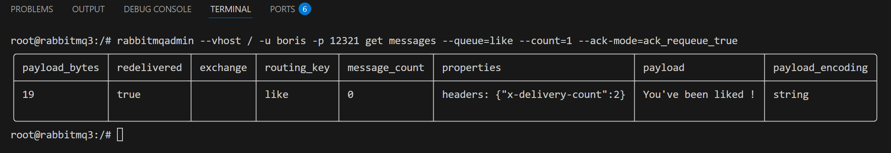

Далее я отключаю первую ноду с именем **`rabbit@rabbitmq1`**, к которой подключался через скрипт и публиковал сообщение.
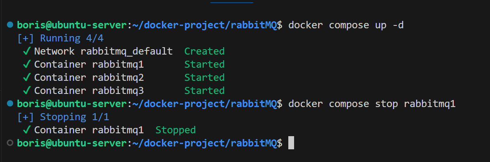

Редактирую **`consumer`**, буду использовать хостовой порт **`5674`**, который я пробрасывал в контейнер ноды **`rabbitmq3`**, и запускаю скрипт.
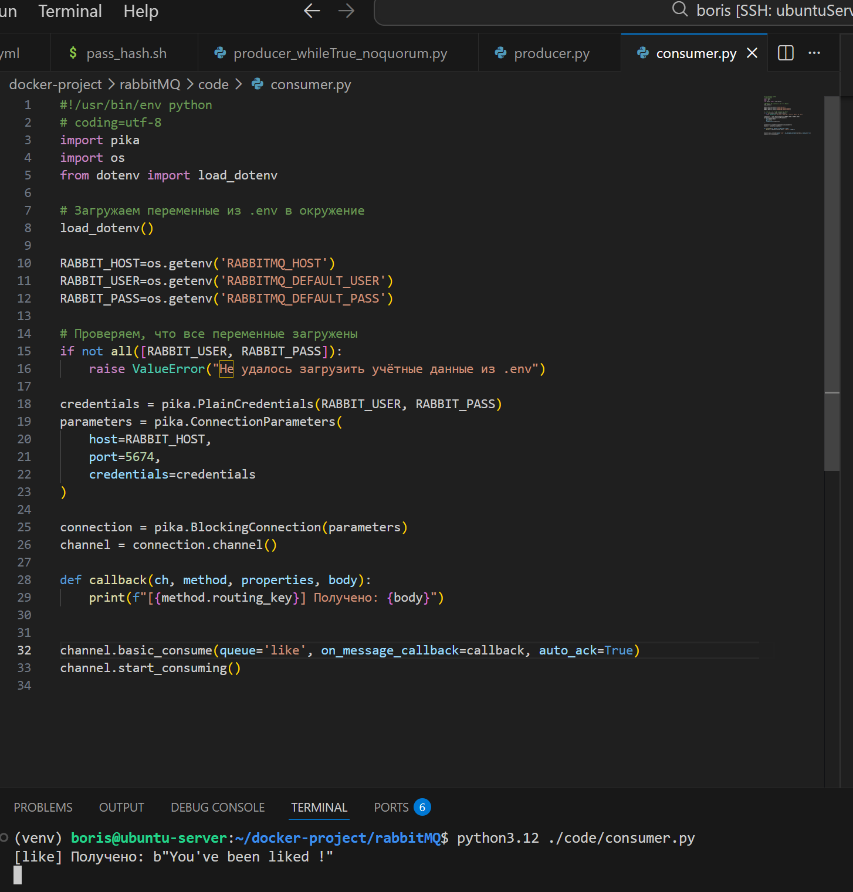

Несмотря на то, что первая нода отключена, кластер не развалился и репликация работает, тем самым мне удалось считать сообщение.