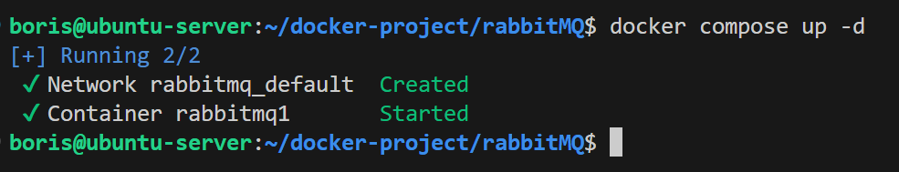
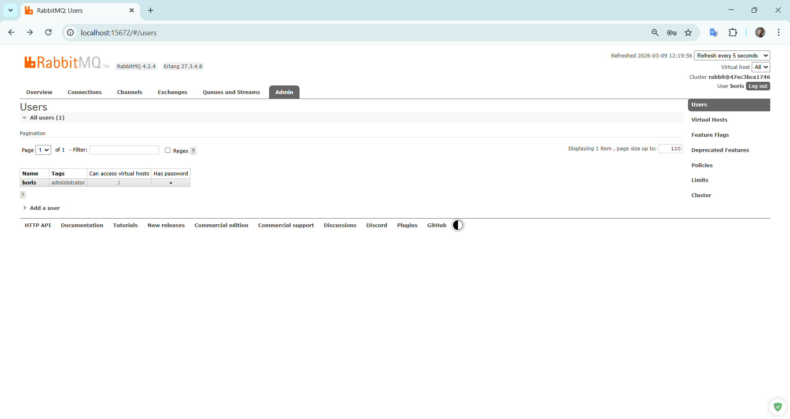

# Домашнее задание к занятию "`Очереди RabbitMQ`" - `Сидоров Борис`

---
---

### Задание 1. Установка RabbitMQ

Используя Vagrant или VirtualBox, создайте виртуальную машину и установите RabbitMQ.
Добавьте management plug-in и зайдите в веб-интерфейс.

*Итогом выполнения домашнего задания будет приложенный скриншот веб-интерфейса RabbitMQ.*

--- 

### Решение 1
Решать задание буду используя **`docker compose`** следуя принципам **`DevOps`** инженера.
Разворачивать контейнер буду используя совсем простой **`docker compose yml`** файл, в котором опишу один сервис **`RabbitMQ`**, проброшу порты для работы **`AMQP`** и веб-интерфейса, а также допишу переменные окружения чтобы переопределить пользователя и пароль.

- **`image: rabbitmq:4.2.4-management`** — суффикс **`management`** говорит о том, что используется образ с включенным плагином управления **`Management Plugin`**
- **`environment`** — значения для переменных будут браться из **`.env`** файла, который находится в корне проекта **`docker`**
  - **`RABBITMQ_DEFAULT_USER=${RABBITMQ_DEFAULT_USER}`**
  - **`RABBITMQ_DEFAULT_PASS=${RABBITMQ_DEFAULT_PASS}`**
- **`ports`**
  - **`15672:15672`**
  - **`5672:5672`**

Итоговый **`docker compose`** файл получился таким:
[**`docker-compose-task1.yml`**](docker-compose/hw-04/docker-compose-task1.yml)

**Демонстрация работы.**  
Запускаю проект.

Для доступа к веб-интерфейсу необходимо использовать порт **`15672`**. Пароль и логин тот, что переопределён переменными окружения.

Готово, я в веб-интерфейсе сервиса **`RabbitMQ`**.